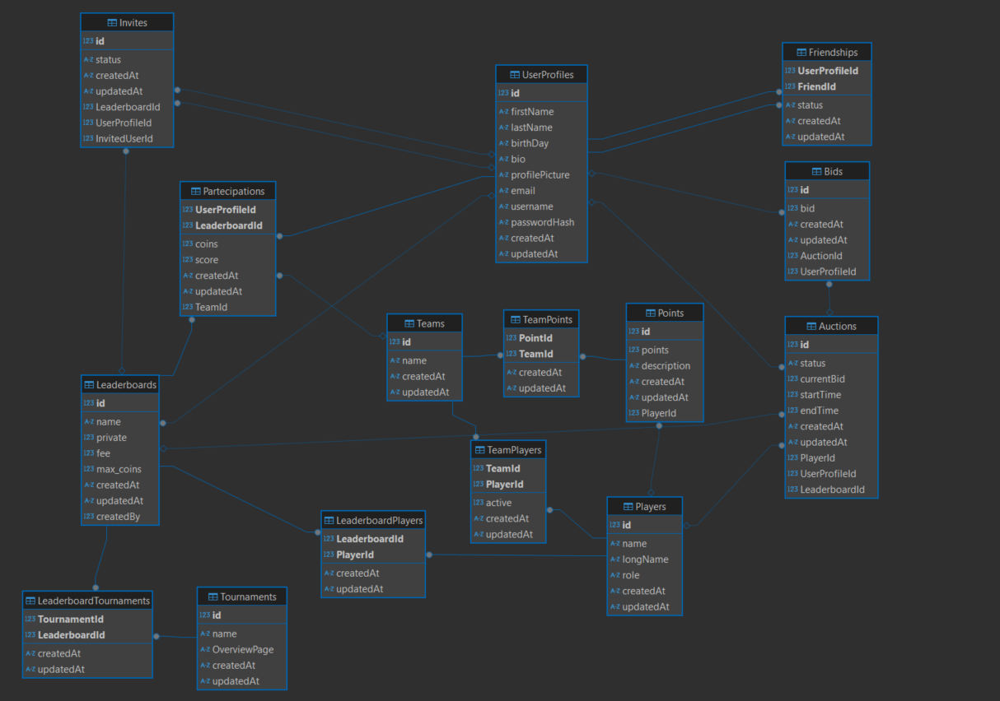

# FantaLoL Backend

Server used for the FantaLoL client

# Tech Stack

- Express for the server
- Socket.io for WebSockets
- SQLite for the database
- Sequelize for the ORM
- Passport for authentication

# Endpoints

### Users

- `POST /users/:id/request` - Send a friend request to the user
- `GET /users/notifications` - Get all the notifications(friend, invite) of the logged user
- `POST /users/acceptFriend` - Accept friend request
- `GET /users/friends` - Get all the friends of the logged user
- `POST /users/send-invite` - Sends an invite to join a leaderboard
- `GET /users/invites` - Get all the user's invites to join a leaderboard
- `POST /users/accept-invite` - Accept the invite to join a leaderboard

### Leaderboards

- `POST /leaderboards/new` - Create a new leaderboard
- `GET /leaderboards/:id` - Get a specific leaderboard
- `GET /leaderboards/user/:id` - Get a all the leaderboards that the user has created
- `GET /leaderboards/:id/user` - Get the info (coins left) for a specific leaderboard of a user
- `GET /leaderboards/user/:id/friends` - Get a all the leaderboards that the user has joined
- `GET /leaderboards/:id/team` - Get a all the players that the user owns for the specific leaderboard

### Auth

- `POST /auth/register` - Register a new user
- `POST /auth/login` - Login a user
- `DELETE /auth/logout` - Logout a user

### Leagues

- `GET /league/tournaments/currentTournaments` - Get all the tournaments of the year
- `GET /league/currentLeagues` - Get the Leagues to which tournaments belong

## Database

 Logical Model

